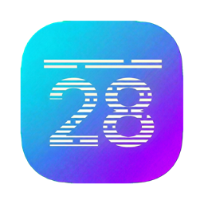
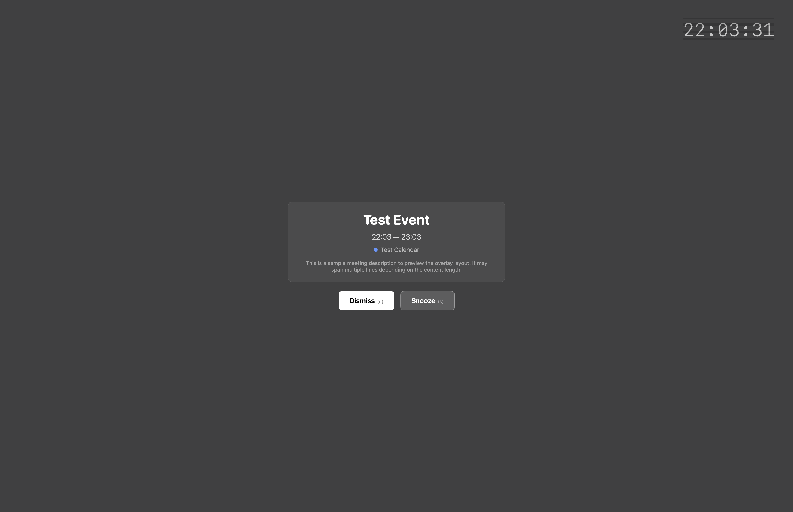

<p align="center">
  
</p>

<h1 align="center">Scanline</h1>

<p align="center"><em>never miss the signal</em></p>

<p align="center">
  Full-screen calendar overlays for macOS.<br>
  CRT-style notifications that cut through deep focus when it matters.
</p>

---

<p align="center">
  
</p>

<p align="center">
  <a href="https://www.youtube.com/watch?v=evFfNdNE1CM">
    
  </a>
</p>

## Features

- **Full-screen overlay** - unmissable event alerts that cover all screens, above everything including full-screen apps
- **Live clock** - HH:mm:ss clock with CRT scanline effect in the top-right corner
- **Event details** - shows title, time range, calendar, and description (up to 5 lines)
- **Keyboard shortcuts** - `d` to dismiss, `s` to snooze, then `1`-`0` to pick a duration
- **Flexible snooze** - 1/5/10/15/30 min, 1/2/4 hours, or tomorrow at 9:00/13:00
- **Menu bar app** - lives quietly in your menu bar, no dock icon
- **Multi-calendar support** - pick which calendars to monitor (any calendar synced to macOS Calendar - Google, iCloud, Exchange, etc.)
- **Smart alarm detection** - triggers on both explicit alarms and event start times
- **Zero dependencies** - native Swift + SwiftUI + AppKit, macOS 14.0+

## Install

### Homebrew

```
brew install duke8585/scanline/scanline
```

### Manual

Download the latest `.zip` from [Releases](https://github.com/duke8585/scanline-macos/releases), unzip, and move `Scanline.app` to `/Applications`.

### Build from source

```
make build
make run
```

Requires macOS 14.0+ and Xcode Command Line Tools. No Xcode project needed - builds with `swiftc` directly.

## How it works

Scanline monitors your system calendars via EventKit and throws a full-screen CRT-style overlay across every display when an event alarm fires - on top of everything, including full-screen apps. The overlay fades in with a retro CRT scanline animation, shows the event details, and lets you dismiss or snooze before diving back in.

On first launch, grant calendar access when prompted. Open Settings from the menu bar to pick which calendars to monitor.

### Keyboard shortcuts without clicking

For keyboard shortcuts (`d`, `s`, etc.) to work immediately when the overlay appears - without clicking it first - Scanline needs Input Monitoring permissions. Go to **System Settings > Privacy & Security > Input Monitoring** and add Scanline. Without this, you'll need to click the overlay once before hotkeys respond.

## Contributing

See [CONTRIBUTING.md](CONTRIBUTING.md).

## License

MIT
